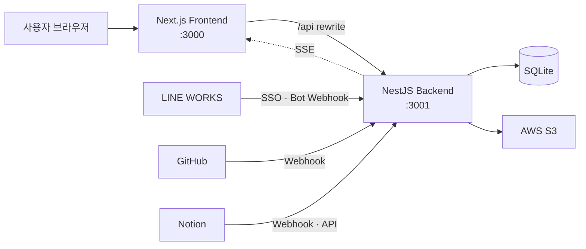

<h1 align="center">Work Tracking</h1>

<p align="center">
  <strong>업무와 팀의 컨텍스트를 한곳에 모으는 통합 워크 대시보드</strong><br />
  태스크 · 캘린더 · GitHub · Notion · LINE WORKS · 파일 · 사이트 링크
</p>

<p align="center">
  
  
  
  
  
</p>

## Overview

Work Tracking은 흩어진 업무 정보와 협업 이벤트를 한 화면에서 확인하고 연결하는 사내용 대시보드입니다. 태스크에 Notion 페이지, LINE WORKS 메시지와 첨부 파일, Figma 노드, 외부 URL을 참조로 연결해 업무의 맥락을 함께 관리할 수 있습니다.

## Features

- **태스크 관리** — 생성, 수정, 삭제, 상태 변경, 우선순위, 마감일·시각, 예상 시간, 상·하위 태스크를 지원합니다.
- **팀 단위 할당** — 여러 담당자를 지정하고 담당자·작성자·상태·우선순위로 검색 및 필터링할 수 있습니다.
- **통합 캘린더** — 날짜별 태스크, GitHub 이벤트, Notion 업데이트, LINE WORKS 메시지, 저장 파일을 함께 보여줍니다.
- **GitHub 피드** — Webhook으로 커밋과 Pull Request 변경을 수집하고 저장소별로 확인합니다.
- **Notion 피드** — 페이지 업데이트를 수집하며 사용자별 읽음 상태와 새 알림 수를 관리합니다.
- **LINE WORKS 연동** — 조직 SSO, Bot 메시지 아카이브, 첨부 파일 저장, 링크 미리보기를 지원합니다.
- **업무 컨텍스트 연결** — 메시지, 첨부 파일, Notion 페이지, Figma 노드, 사이트 링크와 일반 URL을 태스크에 연결합니다.
- **파일·링크 허브** — S3 파일을 채널별 트리로 탐색하고, 자주 쓰는 사이트 링크를 카테고리별로 관리합니다.
- **실시간 갱신** — Server-Sent Events로 외부 서비스의 새 이벤트를 대시보드에 반영합니다.

## Architecture



- npm workspaces 기반 모노레포입니다.
- 프론트엔드의 `/api/*` 요청은 `BACKEND_BASE_URL`의 NestJS API로 전달됩니다.
- SQLite 스키마와 컬럼 마이그레이션은 백엔드 시작 시 자동 적용됩니다.
- 인증이 필요한 API는 네이버웍스 조직 SSO 세션으로 보호됩니다.

## Tech Stack

| 영역 | 기술 |
| --- | --- |
| Frontend | Next.js 16, React 19, TypeScript, Tailwind CSS 4 |
| Backend | NestJS 11, TypeScript, Node.js SQLite |
| Database | SQLite, raw SQL |
| Authentication | LINE WORKS OAuth 2.0, cookie session |
| Integrations | GitHub Webhook, Notion Webhook/API, LINE WORKS Bot |
| File Storage | AWS S3, Presigned URL |
| Realtime | Server-Sent Events |
| Production | EC2, Nginx, PM2, Let's Encrypt |

## Getting Started

### Prerequisites

- Node.js 22 이상
- npm 10 이상
- 로그인을 위한 LINE WORKS Developer Console 애플리케이션
- 선택 연동에 필요한 GitHub, Notion, LINE WORKS Bot, AWS 자격 정보

### 1. Install

```bash
git clone https://github.com/nes0903/work-tracking.git
cd work-tracking
npm install
```

### 2. Configure

```bash
cp front/.env.example front/.env.local
cp back/.env.example back/.env
```

- `front/.env.local`의 `BACKEND_BASE_URL`은 기본적으로 `http://127.0.0.1:3001`을 사용합니다.
- `back/.env`에는 먼저 로그인에 필요한 `LINE_WORKS_CLIENT_ID`, `LINE_WORKS_CLIENT_SECRET`, `LINE_WORKS_REDIRECT_URI`, `LINE_WORKS_DOMAIN_ID`를 입력합니다.
- GitHub, Notion, Bot, S3 환경 변수는 해당 연동을 사용할 때만 설정하면 됩니다.
- 비밀 키와 실제 환경 변수 파일은 커밋하지 않습니다.

### 3. Run

두 터미널에서 백엔드와 프론트엔드를 각각 실행합니다.

```bash
# terminal 1
npm run dev:back
```

```bash
# terminal 2
npm run dev:front
```

- App: [http://localhost:3000](http://localhost:3000)
- API health check: [http://localhost:3001/health](http://localhost:3001/health)
- Local database: `back/sqlite/work-tracking.sqlite3`

> 백엔드를 처음 실행하면 로컬 SQLite 파일과 필요한 테이블이 자동으로 준비됩니다.

## Environment Variables

전체 기본값과 변수 목록은 [`front/.env.example`](./front/.env.example)과 [`back/.env.example`](./back/.env.example)을 기준으로 관리합니다.

| 구분 | 주요 변수 | 용도 |
| --- | --- | --- |
| Frontend | `BACKEND_BASE_URL` | Next.js가 요청을 전달할 백엔드 주소 |
| Backend | `PORT` | API 서버 포트, 기본값 `3001` |
| LINE WORKS SSO | `LINE_WORKS_CLIENT_ID`, `LINE_WORKS_CLIENT_SECRET`, `LINE_WORKS_REDIRECT_URI`, `LINE_WORKS_DOMAIN_ID` | 조직 계정 로그인 및 접근 범위 제한 |
| LINE WORKS Bot | `LINE_WORKS_BOT_ID`, `LINE_WORKS_BOT_SECRET`, `LINE_WORKS_SERVICE_ACCOUNT`, `LINE_WORKS_PRIVATE_KEY_PATH`, `LINE_WORKS_TARGET_CHANNEL_IDS` | 메시지와 첨부 파일 수집 |
| GitHub | `GITHUB_WEBHOOK_SECRET` | Webhook 서명 검증 |
| Notion | `NOTION_WEBHOOK_VERIFICATION_TOKEN`, `NOTION_API_TOKEN`, `NOTION_API_VERSION` | Webhook 검증과 페이지 메타데이터 조회 |
| AWS S3 | `AWS_REGION`, `S3_BUCKET_LINE_WORKS`, `S3_OBJECT_PREFIX`, `S3_PRESIGN_TTL_SECONDS` | LINE WORKS 첨부 파일 저장과 접근 |

> EC2에서는 장기 AWS 액세스 키보다 IAM Instance Profile 사용을 권장합니다.

## Webhook Endpoints

| 서비스 | Endpoint | 설명 |
| --- | --- | --- |
| GitHub | `POST /api/github/webhook` | Push 및 Pull Request 이벤트 수신 |
| Notion | `POST /api/notion/webhook` | 페이지 변경 이벤트 수신 |
| LINE WORKS Bot | `POST /api/line-works-bot/callback` | 메시지 및 첨부 이벤트 수신 |

- 외부 Webhook에는 HTTPS로 접근 가능한 공개 URL이 필요합니다.
- Webhook URL을 등록하기 전에 각 서비스의 검증용 환경 변수를 먼저 설정하세요.

## Scripts

루트에서 다음 명령을 실행할 수 있습니다.

| Command | Description |
| --- | --- |
| `npm run dev:front` | Next.js 개발 서버 실행 |
| `npm run dev:back` | NestJS watch 서버 실행 |
| `npm run build` | 프론트엔드와 백엔드 프로덕션 빌드 |
| `npm run lint` | 전체 워크스페이스 ESLint 검사 |
| `npm run build:front` | 프론트엔드만 빌드 |
| `npm run build:back` | 백엔드만 빌드 |
| `npm --workspace back run test` | 백엔드 Jest 테스트 실행 |
| `npm --workspace back run migrate:s3-keys:dry` | S3 키 마이그레이션 사전 확인 |
| `npm --workspace back run migrate:s3-keys` | S3 키 마이그레이션 실행 |

## Project Structure

```text
work-tracking/
├── front/
│   └── src/
│       ├── app/                  # Next.js App Router
│       ├── components/ui/        # 공통 UI 컴포넌트
│       ├── components/work-tracking/
│       │                         # 대시보드 도메인 컴포넌트
│       ├── lib/                  # API 경계, 타입, 유틸리티
│       └── providers/            # 전역 Provider
├── back/
│   ├── src/
│   │   ├── common/               # 인증과 공통 요청 처리
│   │   ├── configs/              # 환경 설정
│   │   ├── databases/            # DB 초기화
│   │   ├── libs/                 # SQLite 쿼리와 외부 연동
│   │   └── services/             # 도메인별 NestJS 모듈
│   ├── sqlite/schema.sql         # SQLite 스키마
│   └── scripts/                  # 운영·마이그레이션 스크립트
├── stitch_syncflow_task_dashboard/
│                                  # 초기 UI 시안과 디자인 자료
├── *_PLAN.md                      # 기능별 설계 문서
├── issue.md                       # 연동 이슈와 해결 기록
└── worklog.md                     # 배포·인프라 작업 기록
```

## Quality Check

변경 사항을 올리기 전에 아래 검사를 권장합니다.

```bash
npm run lint
npm run build
npm --workspace back run test
```

## Related Docs

- [`TASK_DASHBOARD_PLAN.md`](./TASK_DASHBOARD_PLAN.md) — 태스크 대시보드 구조와 조회 정책
- [`TASK_CONTEXT_PLAN.md`](./TASK_CONTEXT_PLAN.md) — 태스크 참조 통합 모델
- [`LINE_WORKS_BOT_PLAN.md`](./LINE_WORKS_BOT_PLAN.md) — Bot, 첨부 파일, S3 연동 구조
- [`CALENDAR_PLAN.md`](./CALENDAR_PLAN.md) — 통합 캘린더 설계
- [`back/notion-webhook-setup.md`](./back/notion-webhook-setup.md) — Notion Webhook 설정
- [`issue.md`](./issue.md) — 운영 이슈 및 디버깅 기록
- [`worklog.md`](./worklog.md) — 배포와 인프라 변경 이력

---

<p align="center">Built for focused work, with all the context attached.</p>
